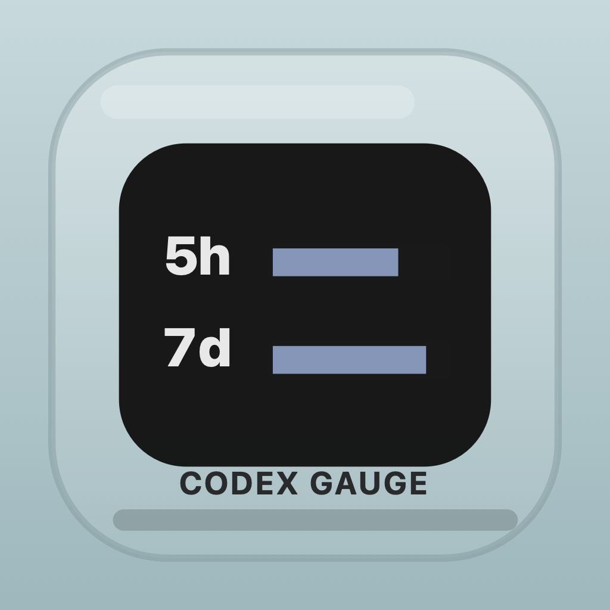
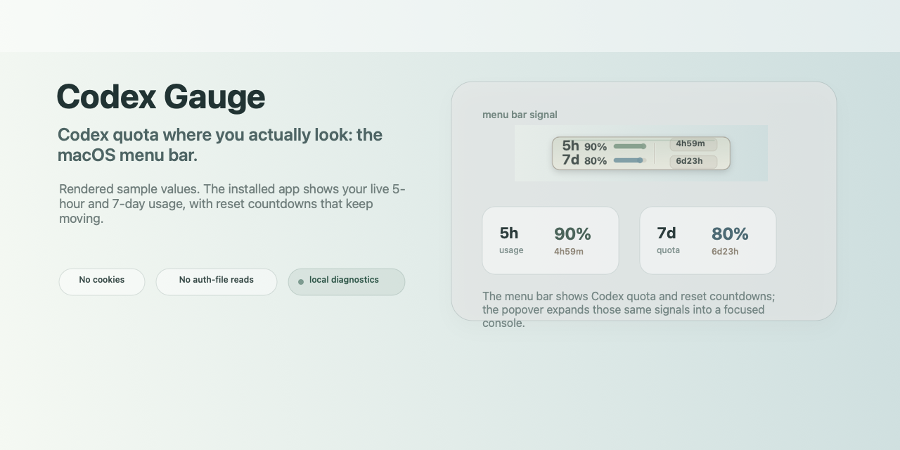

# Codex Gauge

[](https://github.com/qingzhangeddie-byte/codex-gauge/actions/workflows/test.yml)
[](https://github.com/qingzhangeddie-byte/codex-gauge/releases/latest)
[](LICENSE)






_Rendered public image with static sample values. The installed app renders your live Codex usage percentages, horizontal bars, and reset countdowns._

**A calm, safe macOS menu bar app to check Codex usage: 5-hour and 7-day quota, live reset countdowns, and no browser-cookie reads.**

Stop guessing how much Codex you have left.

Codex Gauge puts your 5-hour and 7-day usage percentages, horizontal bars, and reset countdowns directly in the macOS menu bar, with a compact Signal Console when you need more detail.

Codex Gauge 会把 Codex 5 小时和 7 天使用百分比、横向条和重置倒计时直接放进 macOS 菜单栏；需要更多细节时，点开 Signal Console 就能看到完整状态和数据来源。

Open Codex once, keep Codex Gauge running, and the menu bar refreshes hands-free.

打开一次 Codex 后保持 Codex Gauge 运行，菜单栏就会自动刷新，不需要额外设置浏览器或复制登录信息。

No browser cookies. No `~/.codex/auth.json`. No prompt or response logging.

不读取浏览器 Cookie，不读取 `~/.codex/auth.json`，不记录 prompt 或 response 内容。

Install from source with one command:

```bash
bash install.sh
```

What makes it different:

- Built for one job: Codex quota at a glance.
- Native menu bar first, detailed Signal Console only when you click.
- Transparent system-monitor bars instead of a noisy dashboard wedged into the status bar.
- Clear Signal Console labels for Live, Last live, Snapshot, and Codex closed states.
- Local-only diagnostics and reports, designed to avoid private prompt/session content.

Codex Gauge is an **Unofficial** macOS menu bar app for people who use Codex heavily and want a Codex rate limit tracker that stays local.

Codex Gauge 是一个**非官方** macOS 菜单栏工具，适合频繁使用 Codex、想要本地查看 Codex rate limit 的用户。

It shows remaining Codex 5-hour usage and Codex 7-day quota without opening a dashboard, reading browser cookies, or exposing local auth files to a menu bar process.

它可以直接显示 Codex 5 小时剩余额度和 Codex 7 天剩余额度，不需要打开 dashboard，不读取浏览器 Cookie，也不会把本地登录文件暴露给菜单栏进程。

Search phrases this project is designed to answer naturally: **check Codex usage**, **OpenAI Codex usage monitor**, **Codex quota tracker**, **Codex rate limit tracker**, **Codex 5-hour limit**, **Codex 7-day quota**, **macOS Codex menu bar app**, and **Codex usage menubar**.

这个项目自然覆盖的中文搜索词包括：**查看 Codex 使用量**、**Codex 额度监控**、**Codex 菜单栏工具**、**Codex 5 小时限制**、**Codex 7 天额度**、**OpenAI Codex 使用量监控**。


_Menu bar strip render. Static sample values; live values update in the installed app._

## What You Get

- Compact menu bar gauge for Codex 5-hour and 7-day usage percentages, horizontal bars, and refresh countdowns
  菜单栏紧凑显示 Codex 5 小时和 7 天使用百分比、横向条，以及刷新倒计时
- System-monitor horizontal bars keep quota health readable without turning the menu bar into a large widget
  系统监控风格的横向条让菜单栏里的额度健康状态更直观，同时不会变成很占位置的大组件
- Custom Signal Console popover with status, quota, reset timing, trend, doctor checks, diagnostics, and actions
  自定义 Signal Console 弹出面板显示状态、额度、重置时间、趋势、诊断检查、安全诊断和操作入口；下拉菜单显示额度重置时间和上次刷新时间
- Signal Console shows the actual next-refresh countdown, not a static refresh label
  Signal Console 显示真实的下次刷新倒计时，不再只是静态刷新标签
- Three selectable themes: Blue Ceramic by default, Signal Dark, and Mono Graphite
  三套可选主题：默认 Blue Ceramic，并提供 Signal Dark 和 Mono Graphite
- First-run setup explains the local-only model and points new users to Codex, Setup Doctor, and the menu bar
  首次运行设置页会解释本地优先模式，并引导新用户打开 Codex、运行 Setup Doctor、开始使用菜单栏
- Preferences and Setup Doctor use the same selected Signal Console theme
  Preferences 和 Setup Doctor 会跟随当前选择的 Signal Console 主题
- Time-based trends show signed 5-hour movement in the current reset window and 7-day movement over the last 24 hours
  趋势不再按模糊样本数展示，而是显示当前 5 小时窗口变化，以及过去 24 小时内的 7 天额度变化，并直接标出正负百分比
- Signal Console copies a current live-only summary; no report file is saved
  Signal Console 可以复制当前实时摘要；不会保存 report 文件
- Clear legacy data removes old Codex Gauge history, cache, report, and log files from earlier builds without touching Codex auth/session data or the current startup setting
  Clear legacy data 只清理旧版本可能留下的历史、缓存、report 和日志文件，不触碰 Codex 登录、会话数据或当前开机启动设置
- Adaptive refresh: 5 minutes normally, 3 minutes when low, 2 minutes when critical, 1 minute after transient errors  
  自适应刷新：正常 5 分钟，额度偏低 3 分钟，严重偏低 2 分钟，临时错误后 1 分钟重试
- Session-only preferences for theme, Adaptive, 5-minute, or 10-minute refresh; launch-at-login is stored as a standard macOS LaunchAgent
  主题和刷新频率偏好只在当前运行会话中生效；开机启动使用标准 macOS LaunchAgent 保存
- Opt-in notifications for low 5-hour quota, restored quota, and prolonged non-live data
  可选通知：5 小时额度偏低、额度恢复、长时间非实时数据都会提醒
- Signal Console states explain Live, Codex closed, and unavailable data directly in the popover
  Signal Console 会在弹出面板解释 Live、Codex closed 和不可用状态
- Signal Console and tooltip states explain Live, Open, and read-only Snapshot fallback; zero persistence still disables cache writes
  Signal Console 和 tooltip 会解释 Live、Open 和只读 Snapshot fallback；Zero persistence 模式仍会关闭缓存写入
- Setup Doctor and Copy Diagnostics help debug local setup without copying prompts, cookies, auth files, or logs
  Setup Doctor 和 Copy Diagnostics 可帮助排查本地设置，但不会复制 prompts、Cookie、auth 文件或日志
- Self-contained app bundle with its helper inside `Contents/Resources`
  自包含 App bundle，helper 打包在 `Contents/Resources` 内
- Local-only storage model: startup LaunchAgent only, with no saved refresh preferences, local histories, quota caches, reports, runtime logs, or support-folder storage
  本地存储模型：只保留开机启动 LaunchAgent，不保存刷新偏好、历史、额度缓存、report、运行日志或 support-folder 存储


This is an actual app-rendered Signal Console screenshot generated from the native macOS view. It uses static sample quota values for the README, not live account data; the installed app keeps usage percentages, horizontal bars, and reset countdowns in the menu bar, with fuller Codex detail in the popover.

上面的 Signal Console 截图由真实 macOS 原生界面渲染生成，但使用 README 静态示例额度数值，不是实时账户数据；安装后的 App 会把使用百分比、横向条和重置倒计时放在菜单栏，并在弹出面板里显示更完整的 Codex 细节。

## Compact menu bar

The compact menu bar gauge uses a transparent system-monitor design: usage percentages and slim horizontal bars on the left, reset countdown text on the right, with no capsule, divider, source stripe, or cap dot.

紧凑菜单栏仪表使用透明系统监控风格：左侧显示使用百分比和细横向条，右侧显示重置倒计时文字；没有胶囊背景、分割线、来源竖条或端点圆点。

The two slim bars use adaptive menu-bar text, blue system-monitor fills, and low-contrast empty tracks so the gauge stays readable on light or dark menu-bar backgrounds.

两个细横向条使用自适应菜单栏文字、蓝色系统监控填充和低对比度空轨道，让 Codex Gauge 在浅色或深色菜单栏背景上都清晰可读。

The public screenshot uses generated sample values so it does not expose account-specific timing; the real menu bar countdown updates live.

公开截图使用生成的示例数值，避免暴露具体账户时间；真实菜单栏倒计时会实时更新。

The two rows are 5-hour usage and 7-day usage. The countdown area shows the 5-hour reset and 7-day reset. System-monitor bars keep the menu bar compact, with adaptive text, blue fills, and quiet empty tracks.

两行分别是 5 小时使用量和 7 天使用量。倒计时区域显示 5 小时重置和 7 天重置。系统监控横向条让菜单栏保持紧凑，并使用自适应文字、蓝色填充和安静的空轨道。


## Quick Start

From a local clone:

```bash
git clone https://github.com/qingzhangeddie-byte/codex-gauge.git
cd codex-gauge
bash install.sh
```

That installs the native app at:

```text
/Applications/CodexGauge.app
```

Codex Gauge should appear in your menu bar with live Codex usage. The installer launches the app and registers `~/Library/LaunchAgents/app.codexgauge.menubar.plist` so it opens again at login; choosing **Quit** stops the current menu bar app.

From a downloaded release package, open `Install Codex Gauge.command`.

After install, Codex Gauge can perform one session-only update check per app run, and **Check for Updates...** always queries the latest GitHub Releases entry on demand. Both paths show the current version, latest version, release info, and notes. Update prompts include release notes and three choices: **Install Update**, **Skip this version**, or **Remind me later**. Skipping is session-only and prevents repeat prompts for that release while the app is running. When a newer release zip is available, **Install Update** downloads it to a temporary directory, verifies the release checksum plus the pinned publisher Team ID/notarization, replaces `CodexGauge.app`, and relaunches. Codex Gauge does not keep update history, skipped-version records, or an updater cache.

For maintainers creating that package:

```bash
./script/package_release.sh
open native/dist/release
```

The generated release output includes a zip, a DMG, `CodexGauge.app`, `Install Codex Gauge.command`, and SHA-256 checksum files. Public 1.0 builds should be Developer ID signed, notarized, and built with `CODEX_GAUGE_UPDATE_TEAM_ID` so in-app installs can verify the publisher.

## Why Codex Gauge is different

| Area | Codex Gauge |
|---|---|
| Native menu bar safety | No browser cookies in the menu bar app |
| Local auth safety | No `~/.codex/auth.json` reads in the menu bar app |
| Packaging | Self-contained app bundle with a bundled helper |
| Menu bar persistence | Launch-at-login via a standard user LaunchAgent |
| Updates | Session-only GitHub release check plus manual Check for Updates, with confirmed Install Update and temporary files only |
| Signal quality | Shows both 5-hour and 7-day quota instead of one vague number |
| Menu bar style | System-monitor bars with adaptive text, blue fills, and quiet empty tracks |
| Refresh behavior | Adaptive refresh instead of constant polling: 5 minutes normally, 3 minutes when low, 2 minutes when critical, with quick retry after transient errors |
| Preferences | Session-only refresh cadence, notifications, and theme controls |
| Notifications | Opt-in alerts for the moments users actually care about |
| Signal Console | Explains whether data is live or unavailable |
| Setup Doctor | Local checks for Codex app, helper, live data, startup state, and notifications |
| Diagnostics | Safe copy-only diagnostics that exclude prompts, cookies, auth files, session contents, histories, caches, reports, and logs |
| Reset timing | Reset timing is visible in the dropdown |
| Setup | Local clone, one install command, no network-piped shell script |

Many usage tools are broad dashboards, token log readers, or browser-session helpers. Codex Gauge is intentionally narrower: it is a small macOS status gauge for the question you ask all day - "how much Codex do I have left?"

很多使用量工具是大而全的 dashboard、token log reader 或浏览器 session helper。Codex Gauge 刻意做得更窄：它只是一个 macOS 状态栏仪表，回答你一天里最常问的问题：“我还剩多少 Codex？”

## SEO Keywords

- OpenAI Codex usage monitor / OpenAI Codex 使用量监控
- Codex quota tracker / Codex 额度监控
- Codex rate limit tracker / Codex rate limit 追踪
- Codex 5-hour limit menu bar / Codex 5 小时限制菜单栏
- Codex 7-day quota monitor / Codex 7 天额度监控
- macOS Codex menu bar app / macOS Codex 菜单栏 App
- safe Codex usage checker / 安全的 Codex 使用量查看工具

## Safety Model

The native menu bar app uses a bundled helper:

```text
CodexGauge.app/Contents/Resources/codex_status.py
```

For live Codex quota, the app talks to the local Codex app-server through the bundled helper. The app runs that helper with zero persistence enabled, so successful live readings are not cached. If the live app-server stalls, app mode can read a fresh Codex-owned rate-limit snapshot from local Codex session data as a read-only emergency fallback.

It does **not** read browser cookies, does **not** read `~/.codex/auth.json`, and does **not** scan unrelated project folders, browser profiles, or Keychain.

Important limitation: the Codex app-server path can start or refresh the Codex 5-hour window because it talks to the same local Codex service used by the Codex desktop app.

More detail: [Privacy Notes](docs/PRIVACY.md), [Security Policy](SECURITY.md), and [Changelog](CHANGELOG.md).

## Requirements

- macOS 13 or newer
- Codex desktop app or Codex CLI installed and signed in
- Xcode command line tools for building from source
- Python 3 available at `/usr/bin/python3`

## Install

```bash
bash install.sh
```

The installer builds and replaces the native menu bar app only. It does not install a broad usage CLI, browser-cookie helper, or auth-file helper.

## Uninstall

Choose **Quit** from the Codex Gauge menu first. Then remove the app and any legacy support files from older builds:

```bash
launchctl bootout "gui/$(id -u)/app.codexgauge.menubar" 2>/dev/null || true
rm -f "$HOME/Library/LaunchAgents/app.codexgauge.menubar.plist"
rm -rf /Applications/CodexGauge.app "$HOME/Library/Application Support/CodexGauge"
```

## Build From Source

```bash
./script/build_and_run.sh --build-only
./script/build_and_run.sh --install
```

Inspect the bundle:

```bash
plutil -p native/dist/CodexGauge.app/Contents/Info.plist
```

The plist should reference `codex_status.py`, not your source checkout.

## Data Sources

| Data | Source |
|---|---|
| Codex live quota | Local Codex app-server |
| Codex fallback quota | Read-only local Codex rate-limit snapshot when the live app-server stalls |
| Menu bar persistence | User LaunchAgent for startup login |
| App storage | No quota cache, logs, histories, reports, or saved refresh preferences |

## FAQ

### How do I see how much Codex quota I have left?

Install Codex Gauge and it shows your Codex 5-hour and 7-day quota directly in the macOS menu bar.

### Is this a Codex rate limit tracker?

Yes. Codex Gauge focuses on Codex quota visibility: remaining 5-hour usage, remaining 7-day usage, and reset timing.

### Does Codex Gauge read browser cookies?

No. The native menu bar app does not read browser cookies, browser profiles, Keychain, or unrelated project folders.

### Does Codex Gauge read `~/.codex/auth.json`?

No. It uses the local Codex app-server for live usage. App mode sets `CODEX_GAUGE_NO_STORAGE=1` so Codex Gauge writes no cache; it may set `CODEX_GAUGE_READ_LOCAL_SNAPSHOT=1` to read a fresh Codex-owned rate-limit snapshot when live data stalls.

### Does this trigger the 5-hour window?

The live Codex app-server path can start or refresh the Codex 5-hour window because it talks to the same local Codex service used by the Codex desktop app.

## Development Checks

```bash
python3 -m unittest discover -s tests -v
./script/build_and_run.sh --build-only
./script/release_check.sh
./script/soak_check.sh --iterations 3 --interval 0
```

## Public Release Notes

Read [Publishing](docs/PUBLISHING.md) before making a public release. `./script/package_release.sh` creates a zip, DMG, and checksum files for review. Public builds should be signed and notarized with your own Apple Developer credentials. Do not publish generated logs, local app bundles, `.venv`, `.env`, screenshots with account details, or files from `~/Library/Application Support/CodexGauge`.

## License

Apache License 2.0. See [LICENSE](LICENSE) and [NOTICE](NOTICE).
