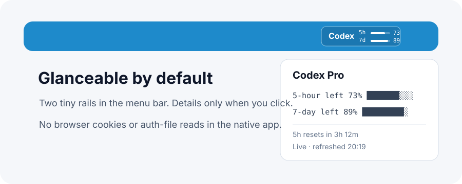

# Codex Gauge


[English](README.md) | 中文说明

Codex Gauge 是一个**简单、安全的 Codex 菜单栏额度仪表**，用于在 macOS 菜单栏直接查看 Codex 5 小时和 7 天额度。

它是非官方本地工具，重点不是做大而全的 dashboard，而是把最常看的信息放到菜单栏：现在还剩多少 Codex。它也可以理解为一个本地的 Codex rate limit tracker，关注 5 小时窗口、7 天额度和重置时间。

## 核心特点

- 菜单栏同时显示 5 小时和 7 天额度
- 下拉菜单显示重置时间和刷新时间
- 自适应刷新：正常 5 分钟，偏低 3 分钟，严重偏低 2 分钟，临时错误后 1 分钟重试
- 原生 App 自带 helper，安装后不依赖源码目录
- 使用用户级 LaunchAgent 保持菜单栏进程常驻，不读取浏览器 Cookie
- 提供有边界的本地快照 fallback；无法取得实时数据时会明确标记为 **Snapshot**
- 原生菜单栏 App 不读取浏览器 Cookie
- 原生菜单栏 App 不读取 `~/.codex/auth.json`
- 日志写入 `~/Library/Application Support/CodexGauge`，并在本地自动轮转



## 四条菜单栏信号


紧凑菜单栏仪表使用已选中的 mood-lane 设计：一行显示 5 小时窗口，一行显示 7 天窗口。四条信号分别是 5 小时额度剩余、5 小时重置倒计时、7 天额度剩余、7 天重置倒计时。额度条保留绿色到红色的健康刻度；重置轨道从红色过渡到珊瑚色、橙色，最后变成温暖黄色。小表情是原生绘制的矢量脸，会随着重置临近向右移动，并从皱眉过渡到微笑，所以倒计时读起来是时间移动，不是危险警报。


颜色状态图是模拟示例，用来展示健康、偏低、严重偏低时的视觉变化，不假装这些就是当前实时额度。

## 快速安装

从本地 clone 安装：

```bash
git clone https://github.com/qingzhangeddie-byte/codex-gauge.git
cd codex-gauge
bash install.sh
```

安装位置：

```text
/Applications/CodexGauge.app
```

通常约一分钟后，菜单栏会出现 Codex 额度仪表。

安装脚本也会写入 `~/Library/LaunchAgents/app.codexgauge.menubar.plist`，让 macOS 保持菜单栏进程运行。从菜单里选择 **Quit** 会卸载当前用户的这个 LaunchAgent。

## 和其他工具的不同

| 方向 | Codex Gauge |
|---|---|
| 菜单栏安全性 | 原生菜单栏 App 不读取浏览器 Cookie |
| 本地登录安全性 | 原生菜单栏 App 不读取 `~/.codex/auth.json` |
| 打包方式 | helper 打包在 App bundle 内部 |
| 菜单栏常驻 | 使用用户级 LaunchAgent，并在 Quit 时明确清理 |
| 信息密度 | 同时展示 5 小时和 7 天额度 |
| 刷新策略 | 根据额度余量自适应刷新：正常 5 分钟，偏低 3 分钟，严重偏低 2 分钟，临时错误后快速重试 |
| 重置时间 | 下拉菜单直接显示重置时间 |
| 安装方式 | 本地 clone 后一条命令安装，不建议网络管道执行 shell |

## 安全模型

原生菜单栏 App 使用打包在 App 内部的 helper：

```text
CodexGauge.app/Contents/Resources/codex_status.py
```

它优先通过本地 Codex app-server 读取实时额度。如果这个路径在 LaunchAgent 场景不可用，helper 会使用有边界的本地快照 fallback：递归查找最近的 Codex session 文件，最多读取 80 个文件，每个文件只读取末尾 2 MB，并且只提取 `rate_limits` 元数据。快照数据会在下拉菜单中明确标记为 **Snapshot**，不会伪装成实时数据。

它不读取浏览器 Cookie，不读取 `~/.codex/auth.json`，也不扫描无关的项目目录、浏览器 profile 或 Keychain。

注意：Codex app-server 路径可能启动或刷新 Codex 5 小时窗口，因为它和 Codex 桌面端使用同一套本地服务。

更多说明见：[Privacy Notes](docs/PRIVACY.md)、[Security Policy](SECURITY.md) 和 [Changelog](CHANGELOG.md)。

## 环境要求

- macOS 13 或更新版本
- 已安装并登录 Codex 桌面端或 Codex CLI
- 从源码构建需要 Xcode command line tools
- 系统可用 `/usr/bin/python3`

## 安装方式

```bash
bash install.sh
```

安装脚本只构建和替换原生菜单栏 App。它不会安装通用使用量 CLI、浏览器 Cookie helper 或 auth 文件 helper。

## 卸载

先在 Codex Gauge 菜单中选择 **Quit**，然后删除 App 和本地支持文件：

```bash
launchctl bootout "gui/$(id -u)/app.codexgauge.menubar" 2>/dev/null || true
rm -f "$HOME/Library/LaunchAgents/app.codexgauge.menubar.plist"
rm -rf /Applications/CodexGauge.app "$HOME/Library/Application Support/CodexGauge"
```

## 从源码构建

```bash
./script/build_and_run.sh --build-only
./script/build_and_run.sh --install
```

检查 bundle：

```bash
plutil -p native/dist/CodexGauge.app/Contents/Info.plist
```

plist 应该只引用 `codex_status.py`，不应该包含你的源码目录路径。

## FAQ

### 如何查看 Codex 还剩多少额度？

安装 Codex Gauge 后，它会在 macOS 菜单栏直接显示 Codex 5 小时和 7 天额度。

### 这是 Codex rate limit tracker 吗？

是。Codex Gauge 专注显示 Codex 额度：5 小时剩余额度、7 天剩余额度和重置时间。

### Codex Gauge 会读取浏览器 Cookie 吗？

不会。原生菜单栏 App 不读取浏览器 Cookie、浏览器 profile、Keychain 或无关项目目录。

### Codex Gauge 会读取 `~/.codex/auth.json` 吗？

不会。它优先使用本地 Codex app-server 获取实时额度，并在不可用时使用有边界、只读的 session 元数据快照 fallback。

### 这会触发 5 小时窗口吗？

实时 Codex app-server 路径可能启动或刷新 Codex 5 小时窗口，因为它和 Codex 桌面端使用同一套本地服务。

## 开发验证

```bash
python3 -m unittest discover -s tests -v
./script/build_and_run.sh --build-only
./script/release_check.sh
```

## License

Apache License 2.0. See [LICENSE](LICENSE) and [NOTICE](NOTICE).
