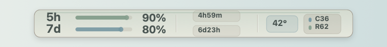
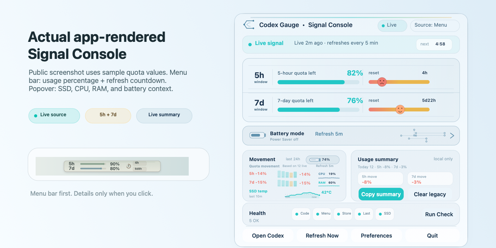
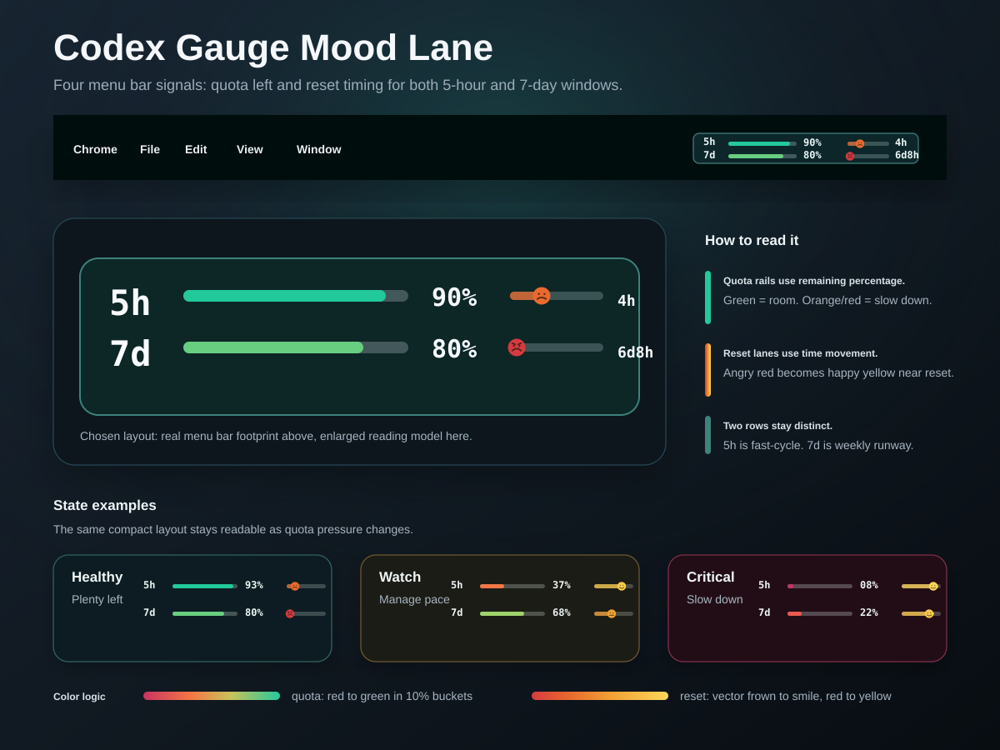
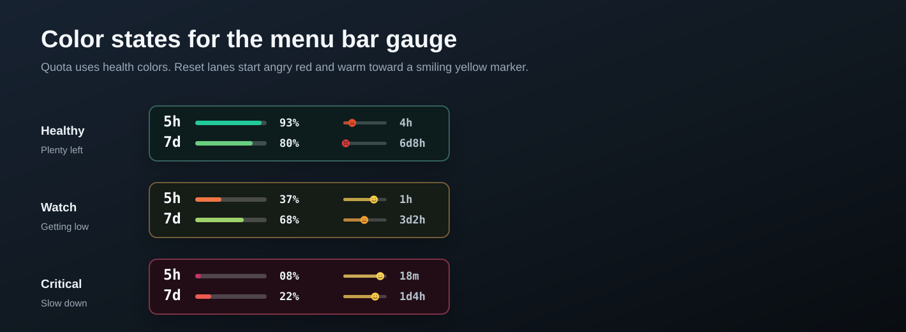

# Codex Gauge



[English](README.md) | 中文说明

Codex Gauge 是一个**简单、安全的 Codex 菜单栏额度仪表**，用于在 macOS 菜单栏直接查看 Codex 5 小时和 7 天额度。

它是非官方本地工具，重点不是做大而全的 dashboard，而是把最常看的信息放到菜单栏：现在还剩多少 Codex。它也可以理解为一个本地的 Codex rate limit tracker，关注 5 小时窗口、7 天额度和重置时间。

不用再猜自己还剩多少 Codex。

Codex Gauge 会把 Codex 5 小时额度、7 天额度、重置倒计时和数据来源直接放进 macOS 菜单栏；需要更多细节时，点开 Signal Console 就能看到完整状态。

打开一次 Codex 后保持 Codex Gauge 运行，菜单栏就会自动刷新，不需要额外设置浏览器或复制登录信息。

不读取浏览器 Cookie，不读取 `~/.codex/auth.json`，不记录 prompt 或 response 内容。

从源码安装只需要一条命令：

```bash
bash install.sh
```

它和其他工具最大的不同：

- 只做一件事：让 Codex 额度一眼可见。
- 菜单栏优先，只有点开时才显示更完整的 Signal Console。
- 清楚标注 Live、Last live、Snapshot 和 Codex closed 状态。
- 诊断和报告都只在本地生成，避免复制私人的 prompt、session 或日志内容。

## 核心特点

- 菜单栏同时显示 5 小时和 7 天额度
- 分段信号条让菜单栏里的额度健康状态更直观，同时不会变成很占位置的大组件
- 可选 SSD 温度后缀会在 macOS 暴露传感器时显示本机硬盘温度，也可以在 Preferences 里关闭
- 下拉菜单、诊断和 Setup Doctor 会把 SSD 温度标注为 Normal、Warm 或 Hot
- 每 30 秒采样一次本地 SSD 温度，并在 Movement 区域显示为平滑的 10 分钟温度曲线，同时进行 24 小时本地保留
- 本地 CPU 和 RAM 百分比会以很小的 CPU/RAM 系统条显示在菜单栏里，并在 Signal Console 中显示为趋势脉冲线
- 每 15 秒采样一次本地 CPU/RAM，保留 10 分钟趋势视图和 24 小时本地 CPU/RAM 历史；写入本地历史文件和菜单栏重绘都会节流
- Battery Saver 会在使用电池时自动启用：Codex 额度仍会每 30 分钟刷新一次，但 SSD 温度和 CPU/RAM 采样会暂停，直到接回电源
- 自定义 Signal Console 弹出面板显示状态、额度、重置时间、趋势、诊断检查、安全诊断和操作入口
- Signal Console 显示真实的下次刷新倒计时，不再只是静态刷新标签
- 四套可选主题：默认 Paper Console，并提供 Clay Console、Signal Dark 和 Mono Graphite
- 首次运行设置页会解释本地优先模式，并引导新用户打开 Codex、运行 Setup Doctor、开始使用菜单栏
- Preferences 和 Setup Doctor 会跟随当前选择的 Signal Console 主题
- 趋势按真实时间窗口显示：当前 5 小时窗口变化，以及过去 24 小时内的 7 天额度变化，并直接标出正负百分比
- Signal Console 会直接显示本地 24 小时额度变化报告；Copy report 只复制，不保存报告文件
- Clear local data 只清理 Codex Gauge 的历史、Last live 缓存和日志，不触碰 Codex 登录或会话数据
- Clear local data 会同时删除温度历史、额度历史、缓存和日志
- Clear local data 会同时删除 CPU/RAM 历史、额度历史、温度历史、缓存和日志
- 自适应刷新：正常 5 分钟，偏低 3 分钟，严重偏低 2 分钟，临时错误后 1 分钟重试
- 偏好设置支持主题、自适应、5 分钟、10 分钟刷新，也可以控制是否登录时启动
- 可选通知：5 小时额度偏低、额度恢复、长时间非实时数据都会提醒
- Signal Console 会在弹出面板解释 Live、Last live、Snapshot、Codex closed 和不可用状态
- 菜单栏会明确标记 Cache、Snapshot 和 Open 状态，避免把非实时数据误认为 Live
- Setup Doctor 和 Copy Diagnostics 可帮助排查本地设置，但不会复制 prompts、Cookie、auth 文件或日志
- 原生 App 自带 helper，安装后不依赖源码目录
- 使用用户级 LaunchAgent 保持菜单栏进程常驻，不读取浏览器 Cookie
- 提供有边界的 fallback：短时 **Last live** 缓存、15 分钟 **Snapshot** 新鲜度保护，并在菜单栏显示来源标记
- 原生菜单栏 App 不读取浏览器 Cookie
- 原生菜单栏 App 不读取 `~/.codex/auth.json`
- 日志写入 `~/Library/Application Support/CodexGauge`，并在本地自动轮转



上面的 Signal Console 截图由真实 macOS 原生界面渲染生成，但使用 README 示例额度数值；安装后的 App 会显示你本机的实时额度、重置倒计时、可选 SSD 温度，以及本地 CPU/RAM 汇总百分比。

## 四条菜单栏信号



紧凑菜单栏仪表使用已选中的 mood-lane 设计：一行显示 5 小时窗口，一行显示 7 天窗口。四条信号分别是 5 小时额度剩余、5 小时重置倒计时、7 天额度剩余、7 天重置倒计时。额度条使用分段信号格，并保留绿色到红色的健康刻度；重置轨道从红色过渡到珊瑚色、橙色，最后变成温暖黄色。小表情是原生绘制的矢量脸，会随着重置临近向右移动，并从皱眉过渡到微笑，所以倒计时读起来是时间移动，不是危险警报。



颜色状态图是模拟示例，用来展示健康、偏低、严重偏低时的视觉变化，不假装这些就是当前实时额度。

## 快速安装

从本地 clone 安装：

```bash
git clone https://github.com/qingzhangeddie-byte/codex-gauge.git
cd codex-gauge
bash install.sh
```

安装位置：

```text
/Applications/CodexGauge.app
```

通常约一分钟后，菜单栏会出现 Codex 额度仪表。

安装脚本也会写入 `~/Library/LaunchAgents/app.codexgauge.menubar.plist`，让 macOS 保持菜单栏进程运行。从菜单里选择 **Quit** 会卸载当前用户的这个 LaunchAgent。

从下载好的 release package 安装时，打开 `Install Codex Gauge.command`。

维护者生成 package 时使用：

```bash
./script/package_release.sh
open native/dist/release
```

生成的 zip 包含 `CodexGauge.app`、`Install Codex Gauge.command` 和 SHA-256 checksum。正式 1.0 公共版本仍建议使用 Developer ID 签名和 notarization。

## 和其他工具的不同

| 方向 | Codex Gauge |
|---|---|
| 菜单栏安全性 | 原生菜单栏 App 不读取浏览器 Cookie |
| 本地登录安全性 | 原生菜单栏 App 不读取 `~/.codex/auth.json` |
| 打包方式 | helper 打包在 App bundle 内部 |
| 菜单栏常驻 | 使用用户级 LaunchAgent，并在 Quit 时明确清理 |
| 信息密度 | 同时展示 5 小时和 7 天额度 |
| 刷新策略 | 根据额度余量自适应刷新：正常 5 分钟，偏低 3 分钟，严重偏低 2 分钟，临时错误后快速重试 |
| Battery Saver | 使用电池时仍保留 Codex 额度显示，但刷新放慢到 30 分钟，并暂停 SSD 温度和 CPU/RAM 采样 |
| 偏好设置 | 内置刷新频率、通知、登录时启动控制 |
| 可选 SSD 温度 | 菜单栏 SSD 温度 chip 可以隐藏；诊断里仍会标注 Normal、Warm 或 Hot；Signal Console 会显示本地 10 分钟温度曲线，并进行 24 小时本地保留 |
| 本地 CPU/RAM 状态 | 菜单栏显示极小 CPU/RAM 系统条，Signal Console 显示趋势脉冲，只保留 24 小时本地百分比历史；采样、写盘和菜单栏重绘都会节流以降低后台能耗 |
| 通知 | 只在用户主动开启后提醒关键额度状态 |
| Signal Console | 直接说明数据是实时、缓存、快照还是不可用 |
| Setup Doctor | 检查 Codex App、helper、实时数据、LaunchAgent 和通知权限 |
| Diagnostics | 安全复制诊断信息，不包含 prompts、Cookie、auth 文件、session 内容或日志 |
| 重置时间 | 下拉菜单直接显示重置时间 |
| 安装方式 | 本地 clone 后一条命令安装，不建议网络管道执行 shell |

## 安全模型

原生菜单栏 App 使用打包在 App 内部的 helper：

```text
CodexGauge.app/Contents/Resources/codex_status.py
```

它优先通过本地 Codex app-server 读取实时额度。每次成功读取实时数据后，helper 会在本地短时缓存；如果临时读不到实时数据，会标记为 **Last live**，表示这是最近一次实时读数。如果实时数据和 Last live 都不可用，helper 才会使用有边界的本地快照 fallback：递归查找最近的 Codex session 文件，最多读取 80 个文件，每个文件只读取末尾 2 MB，并且只提取 `rate_limits` 元数据。快照必须是 15 分钟内捕获的数据；下拉菜单会明确标记为 **Snapshot**，不会把过期数据伪装成实时数据。

它不读取浏览器 Cookie，不读取 `~/.codex/auth.json`，也不扫描无关的项目目录、浏览器 profile 或 Keychain。

注意：Codex app-server 路径可能启动或刷新 Codex 5 小时窗口，因为它和 Codex 桌面端使用同一套本地服务。

更多说明见：[Privacy Notes](docs/PRIVACY.md)、[Security Policy](SECURITY.md) 和 [Changelog](CHANGELOG.md)。

## 环境要求

- macOS 13 或更新版本
- 已安装并登录 Codex 桌面端或 Codex CLI
- 从源码构建需要 Xcode command line tools
- 系统可用 `/usr/bin/python3`

## 安装方式

```bash
bash install.sh
```

安装脚本只构建和替换原生菜单栏 App。它不会安装通用使用量 CLI、浏览器 Cookie helper 或 auth 文件 helper。

## 卸载

先在 Codex Gauge 菜单中选择 **Quit**，然后删除 App 和本地支持文件：

```bash
launchctl bootout "gui/$(id -u)/app.codexgauge.menubar" 2>/dev/null || true
rm -f "$HOME/Library/LaunchAgents/app.codexgauge.menubar.plist"
rm -rf /Applications/CodexGauge.app "$HOME/Library/Application Support/CodexGauge"
```

## 从源码构建

```bash
./script/build_and_run.sh --build-only
./script/build_and_run.sh --install
```

检查 bundle：

```bash
plutil -p native/dist/CodexGauge.app/Contents/Info.plist
```

plist 应该只引用 `codex_status.py`，不应该包含你的源码目录路径。

## FAQ

### 如何查看 Codex 还剩多少额度？

安装 Codex Gauge 后，它会在 macOS 菜单栏直接显示 Codex 5 小时和 7 天额度。

### 这是 Codex rate limit tracker 吗？

是。Codex Gauge 专注显示 Codex 额度：5 小时剩余额度、7 天剩余额度和重置时间。

### Codex Gauge 会读取浏览器 Cookie 吗？

不会。原生菜单栏 App 不读取浏览器 Cookie、浏览器 profile、Keychain 或无关项目目录。

### Codex Gauge 会读取 `~/.codex/auth.json` 吗？

不会。它优先使用本地 Codex app-server 获取实时额度，并在不可用时使用有边界、只读的 session 元数据快照 fallback。

### 这会触发 5 小时窗口吗？

实时 Codex app-server 路径可能启动或刷新 Codex 5 小时窗口，因为它和 Codex 桌面端使用同一套本地服务。

## 常见问题排查

### 安装后菜单栏里看不到 Codex Gauge

macOS 菜单栏太挤时会自动隐藏左侧图标。可以先关闭几个菜单栏 App、缩小当前窗口占用，或从 `/Applications/CodexGauge.app` 重新打开。

### 显示 Open Codex 或 Snapshot，不是 Live

先打开一次 Codex 桌面端。Live 额度来自本地 Codex app-server；Snapshot 只是实时数据不可用时的有边界本地 fallback，并且会明确标注。

### Battery Saver 让刷新变慢了

这是刻意设计的省电模式。使用电池时，Codex Gauge 会保留每 30 分钟一次的额度刷新，并暂停 SSD 温度和 CPU/RAM 采样，接回电源后自动恢复。

### Thought Coach 显示 Offline

Thought Coach 是可选功能。如果你使用 bridge，请打开 **Preferences → Bridge Settings**，确认 LaunchAgent label 和本地路径，再在 Signal Console 里点 **Restart Bridge**。

## 开发验证

```bash
python3 -m unittest discover -s tests -v
./script/build_and_run.sh --build-only
./script/release_check.sh
./script/soak_check.sh --iterations 3 --interval 0
```

## License

Apache License 2.0. See [LICENSE](LICENSE) and [NOTICE](NOTICE).
